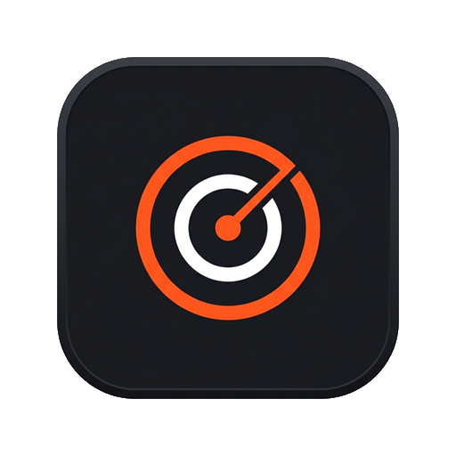

<p align="center">
  
</p>

<h1 align="center">C:Watch</h1>

<p align="center">
  <strong>The Windows Storage Intelligence &amp; Safe Cleaner Application</strong>
</p>

<p align="center">
  <em>Continuously understand how disk space changes over time, identify what is consuming space, detect recurring cache regrowth, and safely reclaim gigabytes with dry-run protection.</em>
</p>

<p align="center">
  <a href="https://github.com/MR-1124/CWatch/releases"></a>
  
  
  
  <a href="LICENSE"></a>
  
</p>

---

## 💡 The Core Problem

Most Windows users and developers eventually face the exact same frustrating question:

> **"Why is my C: drive filling up, where is the space going, and what can I safely delete?"**

Traditional disk cleaners and tree analyzers only tell you what files exist *right now*. They don't tell you **how your disk changed**, **why a folder grew by 20 GB this week**, **what tool created it**, or **what will break if you delete it**.

**C:Watch** is a **Storage Intelligence** desktop application built from the ground up to continuously track filesystem differential deltas, project storage exhaustion trends, detect recurring regenerating bloat, and provide safe, transparent cleanup with full human rationale.

---

## ✨ Key Features

<table>
  <tr>
    <td width="50%">
      <h3>📊 Storage Telemetry Dashboard</h3>
      <p>Live capacity readouts, real-time burn rate calculations (+MB/day), days-to-full forecasts, and visual category heatmaps.</p>
    </td>
    <td width="50%">
      <h3>📁 Hierarchical Storage Explorer</h3>
      <p>Interactive path breadcrumb navigation, proportion-of-parent allocation meters, and instant search filtering.</p>
    </td>
  </tr>
  <tr>
    <td width="50%">
      <h3>📄 Largest Files Locator</h3>
      <p>Quickly identify individual space hogs ranked by byte weight with visual size tiers (&gt;10GB, &gt;2GB, &gt;500MB) and category filter chips.</p>
    </td>
    <td width="50%">
      <h3>📑 Duplicate Files Finder</h3>
      <p>Multi-phase SHA-256 byte hash engine with smart selection presets (<em>Keep Newest</em>, <em>Keep Oldest</em>) and safe deletion workflow.</p>
    </td>
  </tr>
  <tr>
    <td width="50%">
      <h3>📈 Storage Timeline &amp; Differential Deltas</h3>
      <p>Compare historical SQLite snapshots across timeframes (24h, 7d, 30d, 90d) to isolate the exact folders that accumulated space.</p>
    </td>
    <td width="50%">
      <h3>🔄 Recurring Growth Detector</h3>
      <p>Identifies regenerating caches (<code>npm</code>, <code>pip</code>, <code>Docker</code>, <code>Gradle</code>, build artifacts) with calculated regrowth velocities.</p>
    </td>
  </tr>
  <tr>
    <td width="50%">
      <h3>🧹 Recommended Safe Cleanup</h3>
      <p>Transparent safety classifications (<code>SAFE</code>, <code>LOW RISK</code>, <code>REVIEW</code>) with human rationale, dry-run simulation, and live progress reporting.</p>
    </td>
    <td width="50%">
      <h3>📋 Diagnostic Intelligence Reports</h3>
      <p>Generates executive filesystem diagnostic summaries with KPI metrics and 1-click export to standalone styled HTML reports.</p>
    </td>
  </tr>
</table>

---

## 🛡️ Safety & Privacy Guarantee

* **100% Offline & Local**: Zero network requests, zero telemetry, zero analytics. All scanning and history records are stored purely on your local machine.
* **No Accidental Deletions**: Every cleanup candidate explains:
  1. *Why is this here?*
  2. *What happens after cleanup?*
  3. *Will it regenerate automatically?*
* **Dry-Run Confirmation**: Visual summary with running total recovery counter before any file operation executes.

---

## 📥 Installation

### Option 1: Standalone GUI Setup Wizard (Recommended)
1. Download **[`CWatch-Setup-v1.0.0.exe`](https://github.com/MR-1124/CWatch/releases/download/v1.0.0/CWatch-Setup-v1.0.0.exe)** from [GitHub Releases](https://github.com/MR-1124/CWatch/releases).
2. Double-click the executable to launch the step-by-step installation wizard.
3. Configure your installation path and shortcut preferences, then click **Install**.

### Option 2: Setup Zip Package
1. Download **`CWatch-v1.0.0-win-x64-Setup.zip`**.
2. Extract the archive and double-click **`Setup.cmd`** (or `Setup.exe`).
3. C:Watch will install to `%LOCALAPPDATA%\Programs\CWatch` and create Start Menu and Desktop shortcuts.

### Option 3: Portable Package (No Installation Required)
1. Download **`CWatch-v1.0.0-win-x64-Portable.zip`**.
2. Extract anywhere and launch **`CWatch.UI.exe`**.

### Option 3: Build from Source
```powershell
# Prerequisites: .NET 8.0 SDK
git clone https://github.com/MR-1124/CWatch.git
cd CWatch

# Restore & Build
dotnet build CWatch.sln -c Release

# Run
dotnet run --project src/CWatch.UI/CWatch.UI.csproj -c Release
```

---

## 🏗️ Architecture & Technology Stack

```
d:\Project\CWatch\
├── src\
│   ├── CWatch.Core\            # Domain models, enums (SafetyLevel, StorageCategoryType), contracts
│   ├── CWatch.Storage\         # SQLite snapshot repository & history management
│   ├── CWatch.Analysis\        # Differential delta engine, growth analyzer, trend forecasting
│   ├── CWatch.Cleanup\         # Safe cleanup providers (System Temp, Node, Pip, Docker, Windows)
│   ├── CWatch.Infrastructure\  # Win32 API interop (Explorer, Process Locking, Disk Telemetry)
│   ├── CWatch.Monitoring\      # Background sampling timer & disk low alarms
│   └── CWatch.UI\              # WPF MVVM desktop UI with Nordic Terminal design system
└── tests\
    └── CWatch.Tests\           # Comprehensive unit & integration test suite (27 passing tests)
```

- **Runtime**: C# 12 / .NET 8.0 Windows Desktop (WPF)
- **Database**: Local SQLite with WAL mode via `Microsoft.Data.Sqlite`
- **UI Architecture**: MVVM (Model-View-ViewModel) with XAML data binding and async command orchestration
- **Styling**: Bespoke Nordic Terminal Design System (Matte Charcoal &amp; Safety Orange palette)

---

## 🤝 Contributing

Contributions are welcome! Please check out [CONTRIBUTING.md](CONTRIBUTING.md) for development guidelines, building instructions, and commit conventions.

---

## 📜 License

This project is licensed under the MIT License — see the [LICENSE](LICENSE) file for details.

---

<p align="center">
  Built with ❤️ for Windows users and developers who value their disk space and privacy.
</p>
